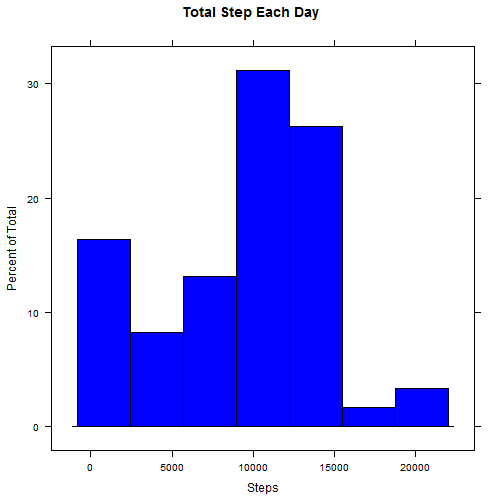
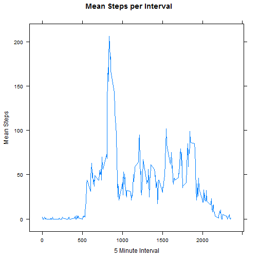
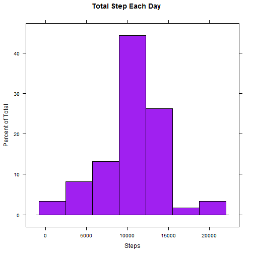
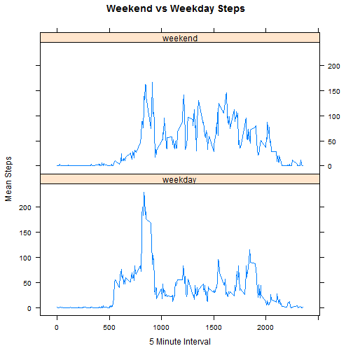

#  Reproducible Research: Peer Assessment 1

It is now possible to collect a large amount of data about personal
movement using activity monitoring devices such as a
[Fitbit](http://www.fitbit.com), [Nike
Fuelband](http://www.nike.com/us/en_us/c/nikeplus-fuelband), or
[Jawbone Up](https://jawbone.com/up). These type of devices are part of
the "quantified self" movement -- a group of enthusiasts who take
measurements about themselves regularly to improve their health, to
find patterns in their behavior, or because they are tech geeks. But
these data remain under-utilized both because the raw data are hard to
obtain and there is a lack of statistical methods and software for
processing and interpreting the data.

This assignment makes use of data from a personal activity monitoring
device. This device collects data at 5 minute intervals through out the
day. The data consists of two months of data from an anonymous
individual collected during the months of October and November, 2012
and include the number of steps taken in 5 minute intervals each day.

## Data

The data is available on the internet at:

* Dataset: [Activity monitoring data](https://d396qusza40orc.cloudfront.net/repdata%2Fdata%2Factivity.zip) [52K]

The variables included in this dataset are:

* **steps**: Number of steps taking in a 5-minute interval (missing
    values are coded as `NA`)

* **date**: The date on which the measurement was taken in YYYY-MM-DD
    format

* **interval**: Identifier for the 5-minute interval in which
    measurement was taken

---

## Loading and preprocessing the data

The step to prepare the data:

1. unzip the csv file

2. Treat the **date** as R date


```r
#  Prepare Data
# Load libraries - plyr to process the data and lattice to plot results
library(plyr)
library(lattice)

#Prepare data
# 
#url <- "https://d396qusza40orc.cloudfront.net/repdata%2Fdata%2Factivity.zip"
#destfile <- "activity.zip"
#download.file(url, destfile, "curl", quiet = TRUE, mode = "wb")
unzip("activity.zip")
activity <- read.csv("activity.csv")
activity$date <- as.Date(activity$date)
```
 


## What is mean total number of steps taken per day?
The initial review of the activite data is to 

1. plot the total number of steps for each day

2. determine the mean and median value for total number of steps taken per day  

Missing values in the 'steps" are ignored.

### Histogram of total steps taken each day

```r
#  compute total step for each day - ignore missing values (NA)
sumByDay <- ddply(activity, .(date), summarize, steps = sum(steps,na.rm = TRUE))
histogram(~ steps, data = sumByDay, main="Total Step Each Day", xlab="Steps", col="blue")
```

 

### Mean and median of steps taken each day

```r
dayMean <- round(mean(sumByDay$steps))
dayMedian <- median(sumByDay$steps)
print(paste("Steps per Day - Mean ", as.character(dayMean), " - Median ", as.character(dayMedian)))
```

```
## [1] "Steps per Day - Mean  9354  - Median  10395"
```


## What is the average daily activity pattern?
Charaterize the daily activity pattern by:

1. Time series plot of the 5-minute interval and the average number of steps taken for days (ignoring missing values)

2. The 5-minute interval, on average across all the days in the dataset, with the maximum number of steps

### Plot of Average Steps vs Interval


```r
intervals <- ddply(activity, .(interval),   summarize,  mean = round(mean(steps,na.rm = TRUE)))
xyplot(mean~interval, data=intervals, t="l", 
       main="Mean Steps per Interval", xlab="5 Minute Interval", ylab="Mean Steps")
```

 

### 5 Minute Interval with Maximum Mean Steps 


```r
print(paste("Interval ",
            as.character(intervals$interval[which.max(intervals$mean)]),
            " with value of  ",as.character(max(intervals$mean))))
```

```
## [1] "Interval  835  with value of   206"
```


## Imputing missing values
The "step" data has missing values that are indicated as "NA" in the data.  Dealing with the missing values involve the following steps:

1. Determine and report the number of rows with missing values

2. Replace the missing values with the mean value for that 5 minute interval

3. Create a new version of the Activity dataset updated to replace the missing values

4. Calculate and plot the new total number of steps taken each day

5. Calculate and report the mean and median value of step taken in a day

First create a vector to identify the intervals with NA values and count the number of NA.


```r
#  Count na values
naS <- is.na(activity$steps)
numNas <- sum(naS)
print(paste("Number of rows with steps = NA is ",as.character(numNas)))
```

```
## [1] "Number of rows with steps = NA is  2304"
```
Replace the NA values with the mean value of steps for that time interval.

```r
newActivity <- activity  #  create a new data frame to hold data with NA replaced
#  Create vector of 5 minute internal means covering all days
allMeans <- rep(intervals$mean, length(unique(activity$date)))
#  Replace all intervals with NA (nas=TRUE) with mean number of steps for that 5 minute interval
newActivity$steps[naS] <- allMeans[naS]
```
Create a new steps take in a day and plot the result.

```r
# Create a new Total Steps by Day without na
newSumByDay <- ddply(newActivity, .(date), summarise, steps = sum(steps))
histogram(~ steps, data = newSumByDay, main="Total Step Each Day", xlab="Steps", col="purple")
```

 


## Are there differences in activity patterns between weekdays and weekends?

Determining if there are differences in activity patterns involves the following steps:

1. Create a new factor variable in the new activity dataset witout missing steps values with two levels -- "weekday" and "weekend" indicating whether a given date is a weekday or weekend day.

2. Make a panel plot containing a time series plot of the 5-minute interval (x-axis) and the average number of steps taken, averaged across all weekday days or weekend days (y-axis).


```r
#  Get day of the week for each date
dayOfWeek <- weekdays(newActivity$date)
#  Create a vector of "weekday"
dT <- rep("weekday", nrow(newActivity))
#  loop to replace the "weekday" with "weekend" for Saturday and Sunday
#  loop over all rows in dataset
for(indx in seq(1:nrow(newActivity))){
      # check if Sunday or Saturday and make as weekend
      if(dayOfWeek[indx] == "Sunday" || dayOfWeek[indx] == "Saturday"){
            dT[indx] <- "weekend"
      }    
}
#  Add type of day to data frame and make into a factor
newActivity <- mutate(newActivity, dayType = dT)
newActivity$dayType <- as.factor(newActivity$dayType)
#  Calculate mean step per 5 minute interval for weekdays and weekends
meanIntervals <- ddply(newActivity, .(interval,dayType),   summarize,  
                       meanSteps = round(mean(steps)))
#  Plot the results Mean Steps vs Interval for weekends and weekdays
xyplot(meanSteps~interval|dayType, data=meanIntervals, t="l", 
       main="Weekend vs Weekday Steps",xlab="5 Minute Interval", ylab="Mean Steps", layout=c(1,2))
```

 
