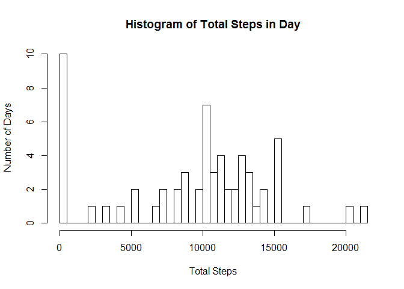
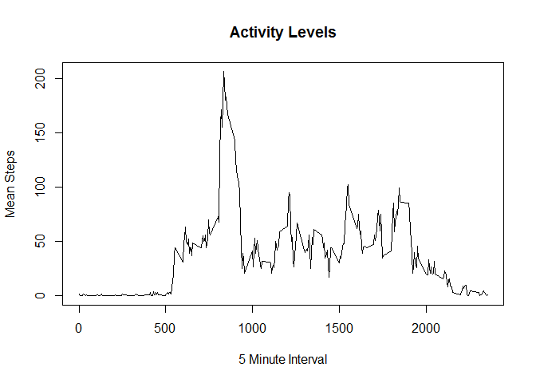
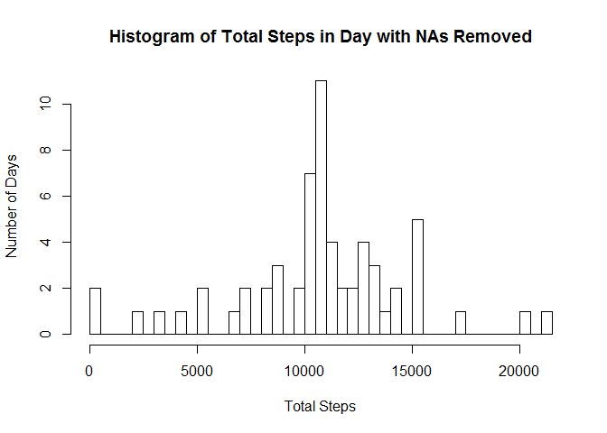
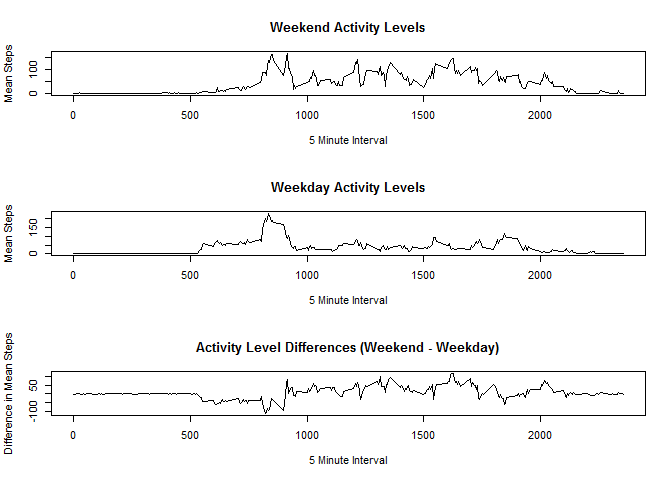

# Reproducible Research: Peer Assessment 1

## Overview
Personal devices are collecting large amounts of personal data using devices such as 
[Fitbit](http://www.fitbit.com), [Nike
Fuelband](http://www.nike.com/us/en_us/c/nikeplus-fuelband), or
[Jawbone Up](https://jawbone.com/up). This project provides an inital analysis of such a data set.


## Data
This assignment makes use of data from a personal activity monitoring
device. This device collects data at 5 minute intervals through out the
day. The data consists of two months of data from an anonymous
individual collected during the months of October and November, 2012
and include the number of steps taken in 5 minute intervals each day.


* Dataset: [Activity monitoring data](https://d396qusza40orc.cloudfront.net/repdata%2Fdata%2Factivity.zip) [52K]

The variables included in this dataset are:

* **steps**: Number of steps taking in a 5-minute interval (missing
    values are coded as `NA`)

* **date**: The date on which the measurement was taken in YYYY-MM-DD
    format

* **interval**: Identifier for the 5-minute interval in which
    measurement was taken

## Loading and preprocessing the data
The data is in a compressed file, **activity.zip**, included GitHub repository that is forked and cloned for this project.  The step involved to prepare the dataset are:
1 unzip the file
2 change **interval** into a *factor* variable


```r
# Load the CSV and clean data - make it tidy
unzip("data/activity.zip")
activity <- read.csv("Data/repdata_data_activity/activity.csv")
#  interval time as factor
activity$interval <- as.factor(activity$interval)
```

## What is mean total number of steps taken per day?
Computing the *mean total number of steps taken per day involves:

* Compute the total steps per day

* Compute the mean of the totals

* Round the computed mean number of step per day

* Compute the median number of step per day

A histogram of *Step per Day* is generated to show the range of daily steps.  The mean and median value for all days are printed.


```r
#  Compute total steps per day
totalStepsPerDay <- tapply(activity[,1], activity[,2], sum, na.rm = TRUE)

# Display histogram of number of day by number of steps
hist(totalStepsPerDay, xlab = "Total Steps", ylab = " Number of Days", 
     main = "Histogram of Total Steps in Day", breaks = 50 )
```

 

```r
#  Calculate and print the mean and median steps per day
meanSteps   = round(mean(  totalStepsPerDay))  #  fraction of steps don't make sense 
medianSteps = median(totalStepsPerDay)
print(paste("Mean   steps per day ", as.character(meanSteps)))
```

```
## [1] "Mean   steps per day  9354"
```

```r
print(paste("Median steps per day ", as.character(medianSteps)))
```

```
## [1] "Median steps per day  10395"
```


## What is the average daily activity pattern?
The daily activity measured by calculating the *average number of steps per 5 minute interval*.  The daily average is plotted where the x axis is the time of day as formatted as *HHMM*.  As an example, *1000* is 10:00 AM.

The *5 minute interval*  with the largest number of step is determined and printed.


```r
#   Compute mean activity level by time interval
#                    steps       interval
avgStepsPerInterval <- tapply(activity[,1], activity[,3], mean, na.rm = TRUE)
avgStepsPerInterval <- round(avgStepsPerInterval)

#  plot Interval vs Mean Step for weekend
plot(names(avgStepsPerInterval), avgStepsPerInterval, type = "l", xlab = "5 Minute Interval", ylab = "Mean Steps", main = "Activity Levels")
```

 

```r
#  Determine the 5 minute interval with max number of steps on average
ml <- which.max(avgStepsPerInterval)  #  find index of max value
maxAvg <- activity$interval[ml]  #  lookup interval with that index
print(paste("5 Minute Interval with maximum average number of steps is ",as.character(maxAvg)))
```

```
## [1] "5 Minute Interval with maximum average number of steps is  835"
```


## Imputing missing values
There are numerous *step* measure with NA value.  Since the *5 minute interval step average* is available for all intervals, a new activity data.frame, *newActivity*, is created with the NA values replaced by the average number of steps for that interval.

The number of missing value is determined and printed.

The mean and median values are recomputed and the Daily Steps Histogram regenerated.


```r
#  determine number of missing values
missingValues <- is.na(activity$steps)  #  creates a vector of booleans where TRUE => NA
print(paste("Number of missing step values ",as.character(sum(missingValues))))  #  summing the booleans => number of NA
```

```
## [1] "Number of missing step values  2304"
```

```r
intervals <- unique(activity$interval)
avgInt <- data.frame(intervals, avgStepsPerInterval)  # create data frame of intervals and average steps
#impute missing values
newActivity <- activity  #  create copy of activity df
for(indx in which(missingValues)){  #  loop through steps equal to NA
      if(missingValues[indx]){
            invVal <- newActivity[indx,3]  #  identify the interval value
            avgStep <- avgInt[avgInt$intervals == invVal,2]
            newActivity[indx,1] <- avgStep
      }
      
}

#  Compute total steps per day
ntotalStepsPerDay <- tapply(newActivity[,1], newActivity[,2], sum, na.rm = TRUE)


hist(ntotalStepsPerDay, xlab = "Total Steps", ylab = " Number of Days", 
     main = "Histogram of Total Steps in Day with NAs Removed", breaks = 50 )
```

 

```r
newMeanSteps   = round(mean(  ntotalStepsPerDay))
newMedianSteps = median(ntotalStepsPerDay)
print(paste("Mean   steps per day with NAs removed ", as.character(newMeanSteps)))
```

```
## [1] "Mean   steps per day with NAs removed  10766"
```

```r
print(paste("Median steps per day with NAs removed ", as.character(newMedianSteps)))
```

```
## [1] "Median steps per day with NAs removed  10762"
```
### Impact of Removing NA steps values

The impact of replacing the NA step values with the average value for that interval is evaluated by determing the changes in the mean and median number of steps per day.


```r
diffMeanSteps = newMeanSteps - meanSteps
diffMedianSteps = newMedianSteps - medianSteps
print(paste("Change in mean   steps per day with NAs removed ", as.character(diffMeanSteps)))
```

```
## [1] "Change in mean   steps per day with NAs removed  1412"
```

```r
print(paste("Change in median steps per day with NAs removed ", as.character(diffMedianSteps)))
```

```
## [1] "Change in median steps per day with NAs removed  367"
```

It is not a great surprise that both the mean and median values increased after NA values for steps are removed.

## Are there differences in activity patterns between weekdays and weekends?

The step involved in evaluating the activity differences between weekdays and weekends are:

1 Marking each row as a *weekday* or *weekend*

2 Computing the average number of step for each interval for *weekday* and *weekend*

3 Plotting the *weekday*, *weekend*, and activity difference (weekend - weekday)


```r
#    Isolate dates and Date
weekdy <- weekdays( as.Date(newActivity$date))

#  Create T/F vector of weekend days
weekends <- weekdy == "Sunday" | weekdy == "Saturday"

#  add new column indicating if date is a weekend or weekday
newActivity$wkpart <- as.factor(c("weekday","weekend"))
newActivity[weekends,]$wkpart <- as.factor("weekend")  #  weekend
newActivity[!weekends,]$wkpart <- as.factor("weekday") #  weekday

library(dplyr)
```

```
## 
## Attaching package: 'dplyr'
## 
## The following object is masked from 'package:stats':
## 
##     filter
## 
## The following objects are masked from 'package:base':
## 
##     intersect, setdiff, setequal, union
```

```r
#  calculate activity means by interval for weekend
wkpart <- filter(newActivity, wkpart == "weekend")  #  isolate weekends
#                    steps       interval
wkendMeans <- tapply(wkpart[,1], wkpart[,3], mean)

par(mfrow = c(3,1))

#  plot Interval vs Mean Step for weekend
plot(names(wkendMeans), wkendMeans, type = "l", xlab = "5 Minute Interval", ylab = "Mean Steps", main = "Weekend Activity Levels")

#  calculate activity means by interval for weekday
wkpart <- filter(newActivity, wkpart == "weekday")  #  isolate weekdays
#                    steps       interval
wkdayMeans <- tapply(wkpart[,1], wkpart[,3], mean)
plot(names(wkdayMeans), wkdayMeans, type = "l", xlab = "5 Minute Interval", ylab = "Mean Steps", main = "Weekday Activity Levels")

wkdiff <- wkendMeans - wkdayMeans
plot(names(wkdiff), wkdiff, type = "l", xlab = "5 Minute Interval", ylab = "Difference in Mean Steps", main = "Activity Level Differences (Weekend - Weekday)" )
```

 


The graphs of the *weekday* vs *weekend* show a number of differences.  On average

1 Weekend activity is lower than weekday until around 9 - sleep later?

2 after around 9 AM, weekend activity is higher during the day than weekday - running errands?

3 Weekday activity goes higher around 6 PM to 8 PM - dinner and getting ready for the next day?

4 Weekend activity goes higher after 8 PM for a short time - going to bed later?
